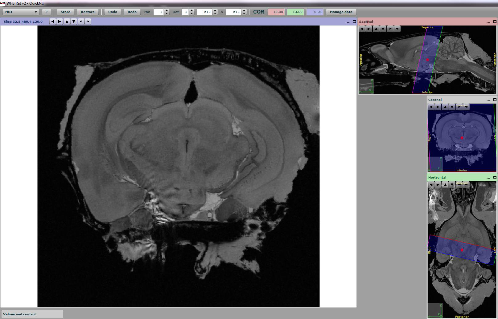

**Introduction**
------------------- 
QuickNII is one of several tools developed by the Human Brain Project
(HBP) with the aim of facilitating brain atlas based analysis and
integration of experimental data and knowledge about the human and
rodent brain. QuickNII is a stand-alone tool for user guided affine
spatial registration (anchoring) of sectional image data, typically high
resolution histological images, to a 3D reference atlas space. A key
feature of the tool is its ability to generate user defined cut planes
through the atlas templates that match the orientation of the cutting
plane of the 2D experimental images (atlas maps). The reference atlas is
transformed to match anatomical landmarks in the corresponding
experimental images. In this way, the spatial relationship between the
experimental image and the atlas is defined, without introducing
transformations in the original experimental images. Following anchoring
of a limited number of sections containing key landmarks,
transformations are propagated across the entire series of images. These
propagations must be validated and saved by the user for each section,
with application of fine positional adjustments as required. We
recommend the use of VisuAlign to perform nonlinear adjustments after
the QuickNII registration for an optimal fit (https://ebrains.eu/service/quicknii-and-visualign).

.. image:: 6bef45ee36424df69f030c687f030605/media/image2.png
   :width: 6.3in
   :height: 4.04916in
Figure from Bjerke et al. 2018. Front Neuroanat.
