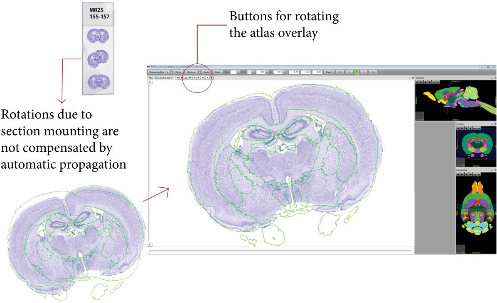

**Final adjustments of in plane position**
---------------------------------------------

Go to another image located at the end of the series and repeat the
anchoring procedure. Once the second image is stored, QuickNII will
automatically calculate the anteroposterior positions of the images, as
well as propagating the registered angles and scaling to the sections
between the anchored sections. This accelerates the anchoring procedure,
and ensures the section spacing and serial order are respected. However,
there might be cases where the automatically propagated parameters do
not fit the section, for example if a section has been tilted during the
mounting procedure. It is therefore essential to validate the positions
by visual inspection, and to correct any mismatch by fine adjustment of
the anteroposterior position, and scaling and rotation of the atlas maps
to match the position of the sections.

**Note!** Once defined, apply the same angles to all the sections in the
series and review each section!

The “export propagation” button allows you to validate all the sections
at once. However, caution is recommended in the use of this feature, as
some sections might not have the correct position. We strongly recommend
reviewing all the sections in order to validate the anchoring. Perform
in plane rotations using buttons in the main window. Rotations in the
small coronal window will result in a rotation around the
anteroposterior axis.

**Note:** Adjustments made with QuickNII are linear. If considerable
mismatch remains between the atlas maps and the sections, despite fine
linear adjustments, further nonlinear adjustments can be applied using
`VisuAlign <https://visualign.readthedocs.io/en/latest/>`_.
