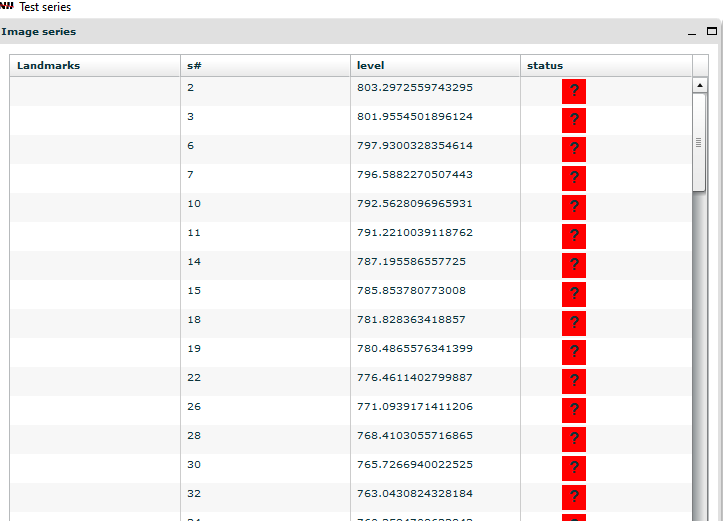

**Start the anchoring**
-----------------------

**1. Open QuickNII and load the data** 

Open the QuickNII program by clicking on the .exe file.
Once the program opens, click the **Manage data button**.

.. image:: 6bef45ee36424df69f030c687f030605/media/image5.png
  :width: 6.30139in
  :height: 3.54662in

A second window, the data management window, will open. Here you can
load your data by clicking the **Load button** and choosing the
**xml** (or JSON) file related to your images, choose the “orig file” the first time.

Navigate between the two windows by clicking the Manage data button.
Select sections to work on by using double-clicking the section
number in the data management window.

**2. Use landmarks in the images to find their approximate anteroposterior position**
   
The first step in a successful anchoring is to find the approximate
anteroposterior position of the slices (Y position for coronal
sections). Do this first for the first and last section of the series
(or first and last sections with clear landmarks).
Select sections to work on by using the arrows in the upper right panel or by
double-clicking the section number in the data management window.

   
Choose your orientation: By clicking on the “Values and control” **(5)** button
     in the bottom left corner, choose the section
     orientation (coronal, sagittal or horizontal).
     
Adjustment of the anteroposterior position
     The anteroposterior position is adjusted by clicking and sliding
     the red circle in the sagittal navigation window **(1)**. After finding
     the approximate position of your section, determine whether the
     midline of the section is completely vertical. If not, the rotation
     of the template can be adjusted using the rotate left/right-buttons
     **(2)**.
The atlas proportions might need adjustment to fit the section.
     This is done separately for the horizontal and vertical
     direction by using the scaling buttons **(3)**. In order to scale your
     atlas, press the space bar while holding the mouse pointer over the
     place you want the reference point for scaling. A small cross will
     appear. Usually it is easier to choose a side and not place the
     cross in the middle of the section. 
     Then, click on the scaling button: a double arrow will appear.
     Place your mouse pointer at the opposite side of the double cross,
     and press the left button of your mouse. While keeping the left
     button of the mouse pressed you can now gently drag the atlas in
     the direction indicated by the double arrow. To drag in the other direction, choose the other arrow.
     
The transparency slider **(4)** 
     it can be used at any time, in order to determine how
     well the atlas fits the section.
     
The “outline” button **(5)**
     This will allows you to shift between an outline view and a color view of the
     atlas segmentations. 
    
Contrast adjustments **(5)**
    Both the experimental image and the template can be adjusted with sliders. Making the MRI template darker or lighter can be helpful sometimes.
    
Save the anchoring **(6)**
    Save by clicking the Store button  in the upper left panel: a green exclamation mark
    appears in the upper right panel.
     

   

   
   
