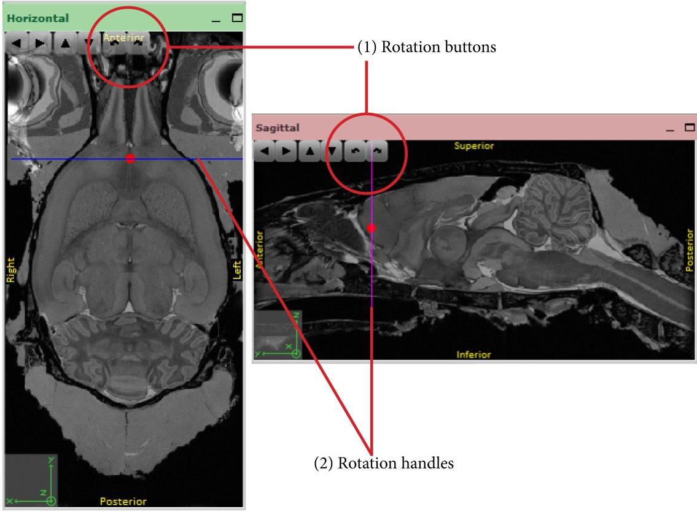
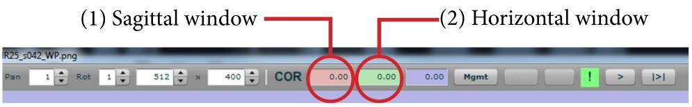

**Determine the sectioning angles**
-----------------------------------
Next, adjust the angles of the atlas slice to match the angles of
sectioning. Even the best sectioning routines can induce small
deviations from the vertical and horizontal planes.
Furthermore, those angles can vary in a whole series, especially if
the tissue was cut into two separate blocks. The cutting angles of
the atlas should be adjusted to match the mediolateral and
dorsoventral angles of the sections. This is done in the horizontal
and sagittal navigation windows, respectively. Use either the
rotation buttons (1) or rotation handles (2) to tilt the MRI
template in the direction needed. Adjust the anteroposterior
position to compensate for the rotation.

