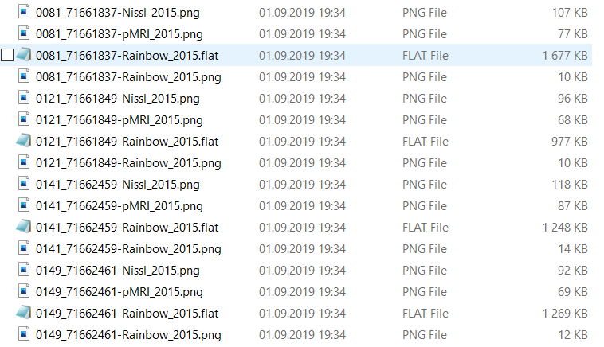
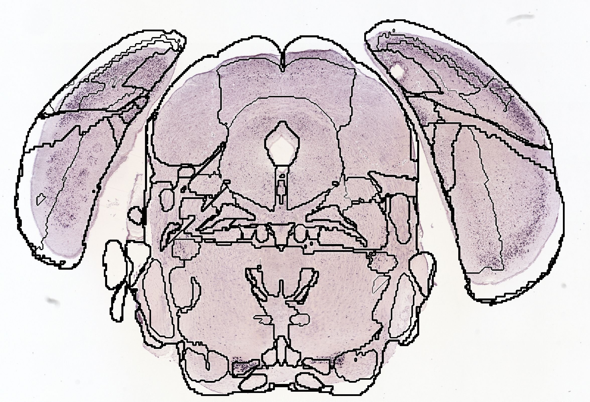

**Export of atlas maps for the QUINT workflow**
---------------------------------------------------
In order to export custom atlas slices corresponding to your series.
Press the “export Slices” button and select the destination folder.

In the export folder, you will also find a file named "segmentation.json" for the rat atlases. This just an information file which gives an overview of the atlas regions label values of the flat files.  

.. note::
   This file should not be confused with the anchoring JSON file used for the QUINT workflow!

**Export of atlas maps contours for overlaying with your images**
------------------------------------------------------------------
In order to export custom atlas slices corresponding to your series.
Press the “export Slices” button and select the destination folder.

Open the exported QuickNII rainbow png files or the exported nl.png files from VisuAlign in ImageJ

- open colorful segmentation image xy_seg.png
- Process/Find Edges
- Image/Type > 8-bit
- Image/Adjust > Threshold..., and pull the upper slider to the far left, Apply. If you untick Dark background, it will also invert the result (to black contour on white background). Auto Local Threshold... (also in Image/Adjust) may achieve a similar result in a couple clicks less.
- Save the image
- Scale to the same dimentions as your raw experimental file (match X and Y), save
- Copy the outline file and paste using "Edit"/"Paste Control...", "Transparent-white".
- Save
    

