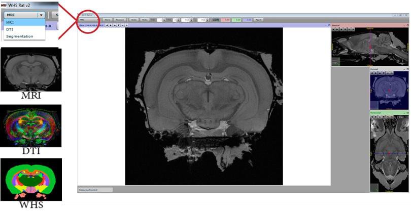
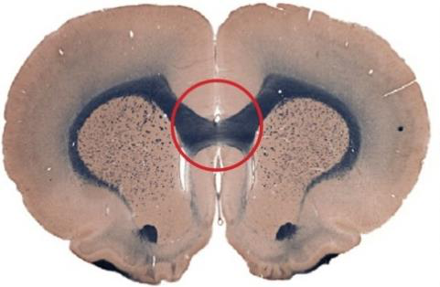
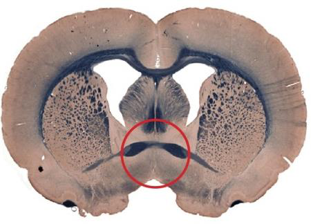
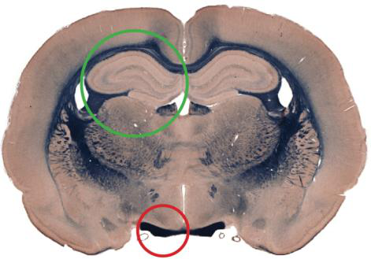

**Landmarks**
---------------
By clicking the roll-down bar in the top left corner, MRI, DTI (for WHS atlas only) or atlas templates can be chosen.
It is useful to use these different atlases actively as they give different information
that can be used when anchoring.
Detailed description of the UI can be found at:https://www.nitrc.org/plugins/mwiki/index.php?title=quicknii:Basic_operation

   
It is easiest to establish the anteroposterior position of sections
that containing key anatomical landmarks. Some examples are shown below:

**Genu of the corpus callosum**

**Decussation of the anterior commissure**

**Optic tract in red, mid-level of the anterior hippocampus** 

