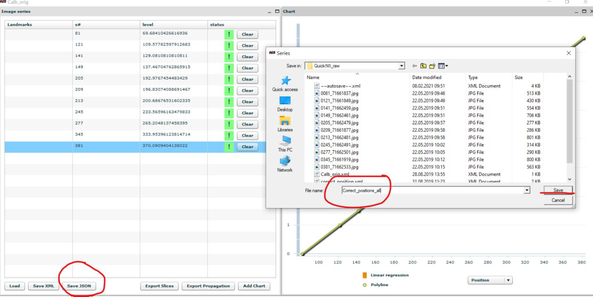
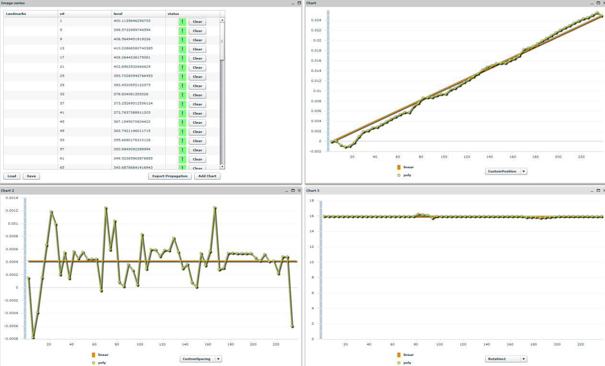

**Saving results and validation**
--------------------------------
Remember to save the anchoring result by clicking “store”. Export the
anchoring vector data by clicking “Save XML” or “save JSON”. The two are
identical; however, the JSON format is required to proceed to nonlinear
registration in VisuAlign.

A new window will open and you will be able to export results into a new
file. Type a new name, e.g. initials and date.

Graphs provide an initial indication of registration accuracy. If
deviations from the linear regression line are present, a revision of
the anchoring should be done. Independent validation by a curator is
recommended.

