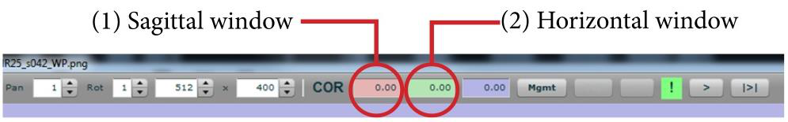

**Saving results and validation**
--------------------------------
Remember to save the anchoring result by clicking “store”. Export the
anchoring vector data by clicking “Save XML” or “save JSON”. The two are
identical; however, the JSON format is required to proceed to nonlinear
registration in VisuAlign.

A new window will open and you will be able to export results into a new
file. Type a new name, e.g. initials and date.

.. image:: 6bef45ee36424df69f030c687f030605/media/image17.png
   :width: 6.30139in
   :height: 3.1582in

Graphs provide an initial indication of registration accuracy. If
deviations from the linear regression line are present, a revision of
the anchoring should be done. Independent validation by a curator is
recommended.

.. image:: 6bef45ee36424df69f030c687f030605/media/image18.png
   :width: 5.37222in
   :height: 3.25228in

-**Positon, Spacing**: position and spacing of section midpoints measured along the internal axis of the series, formed by the section midpoints themselves. Expressed in millimeters. Zero is positioned on the first section.

-**MainPosition, MainSpacing**: position and spacing of section midpoints measured along the main axis selected via the operation mode (like for coronal series, anterior-posterior axis is the main one). Expressed in millimeters. Position is absolute inside the template volume, zero is positioned on the border planes (like most posterior for coronal series).

-**Rotation1/2**: rotation around the primary (red) and secondary (green) axis, dependent on operating mode again. Expressed in degrees. In case of sagittal mode, primary axis is anterior-posterior, secondary axis is vertical.

-**H/VStretch**: ratio between image pixels and atlas voxels. Calculated along the horizontal and vertical edges of the image.
In an ideal world all graphs are straight lines, just like the orange line behind (linear regression of actual data). Position graphs are ideally diagonal, all the others are horizontal at some constant value.

**Quality of the registration can also be assessed with QCAlign**
------------------------------------------------------------------

.. note::
   Find full user documentation `here <https://qcalign.readthedocs.io/en/latest/>`_.
   Download `here <https://www.nitrc.org/projects/qcalign>`_.

QCAlign was developed to support the use of the QUINT workflow for high-throughput studies. It is a quality control tool that provides information about:

1. The quality of the section images used as input to the QUINT workflow. It enables detection of regions that are affected by tissue damage, labelling defects, artifacts, or errors in image acqusition.

2. The quality of the atlas-registration performed in the QUINT workflow.

In addition, QCAlign supports exploration of the reference atlas hierarchy, and the creation of a customized level to use for the investigation. 
